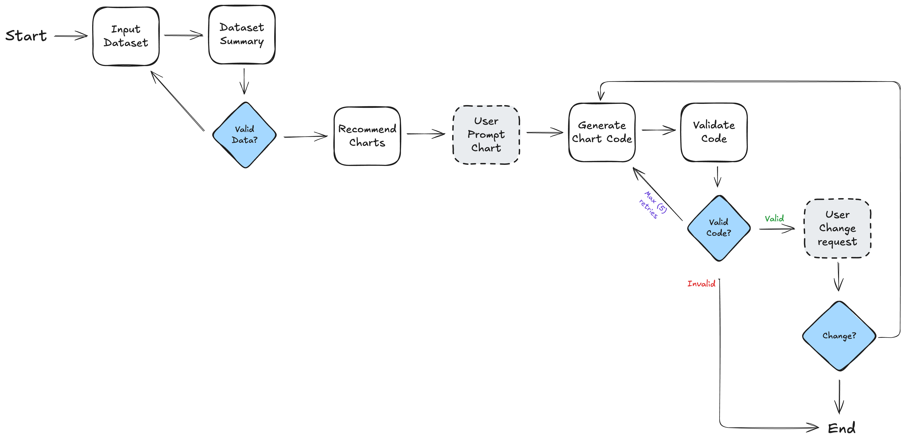

# Langgraph Multi-Step Workflow for Plotly Charts

## Overview

This project is a multi-step workflow designed to generate Plotly charts from a given dataset using Langgraph and various language models. The workflow includes data input, summarization, chart recommendation, user selection, code generation, and validation. It also incorporates Human In The Loop (HITL) design to get feedback from users.

## Features

- Input CSV datasets and perform exploratory data analysis (EDA)
- Generate business questions and chart recommendations based on dataset summaries
- Allow users to select chart types and generate corresponding Plotly code
- Validate and execute generated code to display charts
- Interactive web interface using Streamlit

## Flowchart: https://excalidraw.com/


## Requirements

- Python 3.7 or higher
- Required libraries:
  - `pandas`
  - `langgraph`
  - `langchain`
  - `langchain_ollama`
  - `langchain_google_genai`
  - `plotly`
  - `streamlit`
  
## Installation

1. Clone the repository:

   ```bash
   git clone https://github.com/yourusername/langgraph-chart-gen.git
   cd langgraph-chart-gen
   ```

2. Install the required dependencies:

   ```bash
   pip install -r requirements.txt
   ```

3. Set up your API keys for the language models in your environment variables:

   ```bash
   export GEMINI_API_KEY='your_api_key_here'
   ```

## Usage

### Command Line Interface

To run the workflow from the command line:

```bash
python src/v2_workflow/app.py
```

### Streamlit Web Interface

To launch the Streamlit web application:

```bash
streamlit run src/streamlit_app.py
```

Follow the prompts to:
1. Upload or select your CSV dataset
2. View the dataset summary and suggested business questions
3. Choose a chart type from the recommendations
4. View and interact with the generated Plotly chart

### Example Datasets

The repository includes sample datasets in the `data/` directory:
- `japanvchina.csv`: Comparison data between Japan and China
- Add more example datasets as needed

## Contributing

Contributions are welcome! Please follow these steps to contribute:

1. Fork the repository
2. Create a new branch for your feature or bug fix
3. Make your changes and commit them with clear messages
4. Push your changes to your forked repository
5. Create a pull request describing your changes


## Acknowledgments

- [Langgraph](https://github.com/langchain-ai/langgraph) for providing the framework for building workflows
- [Plotly](https://plotly.com/python/) for the charting library
- [Langchain](https://github.com/langchain-ai/langchain) for the language model integration
- [Streamlit](https://streamlit.io/) for the web application framework
