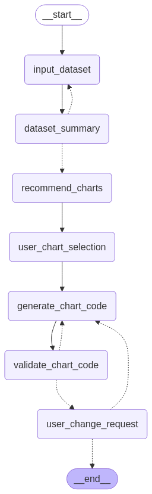

# Langgraph Multi-Step Workflow for Plotly Charts

## Overview

This project is a multi-step workflow designed to generate Plotly charts from a given dataset using Langgraph and various language models. The workflow includes data input, summarization, chart recommendation, user selection, code generation, and validation.

## Features

- Input CSV datasets and perform exploratory data analysis (EDA).
- Generate business questions and chart recommendations based on dataset summaries.
- Allow users to select chart types and generate corresponding Plotly code.
- Validate and execute generated code to display charts.


## Langgraph Flowchart




## Requirements

- Python 3.7 or higher
- Required libraries:
  - `pandas`
  - `langgraph`
  - `langchain_ollama`
  - `langchain_google_genai`
  - `plotly`
  
You can install the required libraries using pip:

```bash
pip install pandas langgraph langchain-ollama langchain-google-genai plotly
```

## Installation

1. Clone the repository:

   ```bash
   git clone https://github.com/yourusername/langgraph-chart-gen.git
   cd langgraph-chart-gen
   ```

2. Install the required dependencies:

   ```bash
   pip install -r requirements.txt
   ```

3. Set up your API keys for the language models in your environment variables:

   ```bash
   export GEMINI_API_KEY='your_api_key_here'
   ```

## Usage

To run the workflow, execute the following command in your terminal:

```bash
python src/v2_workflow/app.py
```

Follow the prompts to input your dataset path, select chart types, and view the generated charts.

### Example

1. When prompted, enter the path to your CSV dataset (default: `data/japanvchina.csv`).
2. The program will summarize the dataset and suggest business questions and chart types.
3. Choose a chart type to generate the corresponding Plotly code.
4. The generated chart will be displayed after validation.

## Contributing

Contributions are welcome! Please follow these steps to contribute:

1. Fork the repository.
2. Create a new branch for your feature or bug fix.
3. Make your changes and commit them with clear messages.
4. Push your changes to your forked repository.
5. Create a pull request describing your changes.

## License

This project is licensed under the MIT License. See the [LICENSE](LICENSE) file for details.

## Acknowledgments

- [Langgraph](https://github.com/yourusername/langgraph) for providing the framework for building workflows.
- [Plotly](https://plotly.com/python/) for the charting library.
- [Langchain](https://github.com/hwchase17/langchain) for the language model integration.
